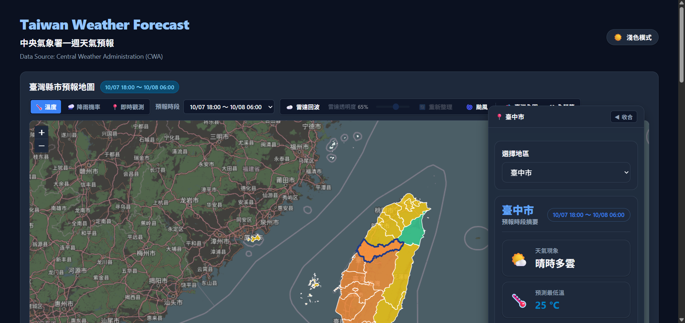
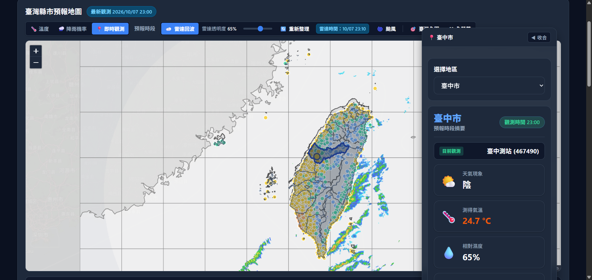
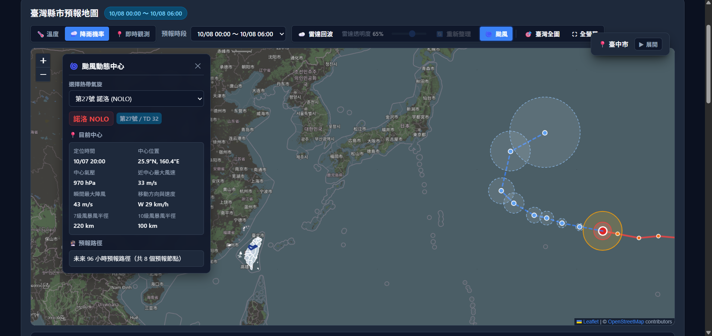

# Taiwan Weather Forecast (中央氣象署臺灣天氣預報與氣象儀表板)

以中央氣象署（CWA）Open Data 為資料來源的臺灣天氣預報與氣象 GIS 儀表板，整合一週縣市預報、降雨機率、即時氣象站觀測、雷達回波與熱帶氣旋路徑，並部署於 Vercel。

[](https://www.python.org/)
[](https://fastapi.tiangolo.com/)
[](https://leafletjs.com/)
[](LICENSE)
[](https://vercel.com/)

---

## 🌐 Live Demo

- **線上展示網址**：[🚀 開啟 Taiwan Weather Forecast Live Demo](https://cwa-4b4l182iq-cwa-weather-project.vercel.app/)
- **雲端部署平台**：Vercel (Serverless Functions)
- **資料庫後端**：Supabase (PostgreSQL with Transaction Pooler)
- **定時更新排程**：Vercel Cron (受保護的排程定時更新)

---

## 📸 System Preview

### Taiwan Weather Dashboard

*縣市溫度面量圖、預報時段切換與縣市詳細資訊整合介面。*

### Radar Reflectivity & Current Observations

*CWA 雷達回波與自動氣象站即時觀測資料的多圖層整合。*

### Typhoon Center & Forecast Track

*熱帶氣旋目前中心、歷史分析路徑、預報路徑、暴風半徑與 70% 預報機率範圍。*

---

## ✨ Main Features (主要功能)

- **全臺 22 縣市一週天氣預報**：整合 CWA `F-C0032-005`，提供各時段天氣現象、預測最高溫與最低溫。
- **互動式氣象 GIS 面量圖 (Choropleth)**：以 Leaflet 1.9.4 構建向量地圖，依預報溫度分級上色，支援懸浮提示 (Tooltip) 與雙向縣市選取連動。
- **預報時段即時切換**：下拉切換未來不同預報區間，地圖多邊形與摘要卡零頁面重整立即反應。
- **今明 36 小時生活預報**：整合 CWA `F-C0032-001`，提供逐 12 小時降雨機率 (PoP) 與舒適度指數 (CI)。
- **自動氣象站即時觀測 (Observations)**：串接 CWA `O-A0001`，在地圖上即時呈現全臺氣象測站溫度、雨量、風向風速與氣壓（真實物理測量值）。
- **雷達整合回波疊加圖層 (Radar Reflectivity)**：串接 CWA `O-A0058-001`（無地形圖資），以獨立 ImageOverlay 呈現即時回波，支援焦點渲染（自動淡化 OSM 底圖）與透明度調整。
- **颱風動態中心與路徑 (Typhoon Center & Track)**：串接 CWA `W-C0034-005`，動態繪製熱帶氣旋中心、歷史分析路徑（實線）、未來預報路徑（虛線）、7級/10級暴風半徑與 70% 預報機率圈。
- **多颱風切換與廣域視角**：多氣旋時提供下拉切換，開啟時自動擴展為西北太平洋廣域視角，關閉時精準還原臺灣視角。
- **一週溫度趨勢折線圖**：整合 Chart.js，動態繪製選定縣市高低溫變化曲線，支援主題色彩同步。
- **詳細時段資料表**：條列呈現未來一週完整時段氣象要素，支援行動裝置水平捲動。
- **深淺色主題切換 (Light / Dark Mode)**：全站支援深色與淺色主題，地圖底圖、圖表、下拉選單與面板無縫適配。
- **響應式工作台 (Responsive Layout)**：桌面版支援左側颱風面板、地圖縮放按鈕無遮蔽與右側詳細面板自動收合；行動版自適應為友善垂直流式版面。

---

## 🏗 Architecture & Data Flow (系統架構)

```text
       ┌──────────────────────────────────────────────┐
       │   Central Weather Administration Open Data   │
       └──────────────────────┬───────────────────────┘
                              │ HTTPS (JSON / XML)
                              ▼
       ┌──────────────────────────────────────────────┐
       │          Python CWA Client (Backend)         │
       └──────────────────────┬───────────────────────┘
                              │
                              ▼
       ┌──────────────────────────────────────────────┐
       │         Parser / Data Normalizer Layer       │
       └──────────────────────┬───────────────────────┘
                              │
                              ▼
       ┌──────────────────────────────────────────────┐
       │            Weather Service Layer             │
       └──────────────┬────────────────┬──────────────┘
                      │                │
       (Forecast Data)│                │(Observations / Radar / Typhoon)
                      ▼                ▼
     ┌──────────────────────┐    ┌────────────────────────┐
     │ Supabase PostgreSQL  │    │ In-Memory Process      │
     │ (Persistent Storage) │    │ Best-Effort Cache      │
     └──────────┬───────────┘    └───────────┬────────────┘
                │                            │
                └─────────────┬──────────────┘
                              ▼
       ┌──────────────────────────────────────────────┐
       │              FastAPI Application             │
       └──────────────────────┬───────────────────────┘
                              │ REST JSON API & Jinja2 Templates
                              ▼
       ┌──────────────────────────────────────────────┐
       │     Frontend: HTML5 + Vanilla CSS + ES6 JS   │
       │     Visualizations: Leaflet.js + Chart.js    │
       └──────────────────────┬───────────────────────┘
                              │
                              ▼
       ┌──────────────────────────────────────────────┐
       │         Vercel Serverless Production         │
       │   (with Scheduled Protected Cron Refresh)    │
       └──────────────────────────────────────────────┘
```

> **資料存取與快取架構說明**：
> - **一週預報資料**：由背景排程或更新端點寫入 Supabase PostgreSQL 資料庫持久化儲存，前端透過 `/api/forecast` 與 `/api/map-data` 查詢最新批次資料。
> - **即時觀測、雷達圖與颱風動態**：由伺服器端即時自氣象署取得並解析，於各 Serverless 執行個體內提供最佳努力 (Best-Effort) 的行程內 TTL 快取，各執行個體記憶體獨立不共享。

---

## 🛠 Tech Stack (技術選型)

| 領域 | 技術 / 工具 | 說明 |
|---|---|---|
| **Backend** | Python 3.12+ | 核心後端開發語言 |
| | FastAPI | 高效能非同步 Web API 框架與 OpenAPI/Swagger 文件生成 |
| | SQLAlchemy & psycopg | PostgreSQL ORM 與高效能資料庫驅動（支援 Transaction Pooler） |
| | pydantic-settings | 集中型型別安全環境變數與組態管理 |
| **Frontend** | HTML5 / Vanilla CSS | 結構化語意標籤與精準 CSS 設計系統（無第三方 CSS 框架負擔） |
| | JavaScript (ES6+) | 原生模組化前端互動邏輯與安全 DOM 操作 |
| | Leaflet 1.9.4 | 互動式 Web GIS 地圖圖層、GeoJSON 面量圖與 ImageOverlay 控制 |
| | Chart.js 4.5.1 | 響應式氣溫趨勢圖表繪製 |
| **Database** | PostgreSQL | 關聯式預報資料持久化 |
| | Supabase | 雲端託管 PostgreSQL 服務 (Transaction Pooler, port 6543) |
| **Infrastructure** | Vercel | Zero-Config Serverless 部署平台 |
| | Vercel Cron | 定時觸發受保護氣象資料更新排程 (`GET /api/cron/refresh`) |
| | GitHub | Git 版本控制與 CI 流程管理 |
| **Testing** | pytest | 包含單元測試、整合測試、Parser 驗證與前端迴歸測試（共 209 項測試全數通過） |

---

## 📊 CWA Open Data Datasets (氣象署開放資料集)

| 資料集代碼 | 資料集名稱 | 類型 | 專案應用說明 |
|---|---|---|---|
| **F-C0032-005** | 一般天氣預報－1週縣市天氣預報 | 預報 (7天) | 22 縣市一週最高溫/最低溫/天氣現象，儲存於 PostgreSQL |
| **F-C0032-001** | 一般天氣預報－今明 36 小時天氣預報 | 預報 (36小時) | 今明 36 小時逐 12 小時預報、降雨機率 (PoP) 與舒適度指數 (CI) |
| **O-A0001** | 自動氣象站即時觀測資料 | 觀測 (即時) | 全臺地面測站即時物理測量值（氣溫、雨量、風速、氣壓） |
| **O-A0058-001** | 雷達整合回波圖－臺灣（較大範圍）_無地形 | 觀測 (圖資) | 3600×3600 高解析度無地形回波圖層，約每 10 分鐘更新 |
| **W-C0034-005** | 颱風動態與路徑預報資料 | 預報/分析 | 西北太平洋及南海熱帶氣旋中心、歷史分析路徑、預報路徑與暴風半徑 |
| **twCounty2010** | 臺灣直轄市、縣市界線 GeoJSON | 圖資 | g0v 釋出之 CC0 邊界向量資料，經座標標準化對齊 22 縣市 |

---

## 🚀 Setup & Local Development (本機開發指南)

### 1. 複製專案庫

```bash
git clone https://github.com/sam052003/CWA.git
cd CWA
```

### 2. 建立並啟動虛擬環境

**Windows (PowerShell)**:
```powershell
python -m venv .venv
.\.venv\Scripts\Activate.ps1
```

**macOS / Linux**:
```bash
python3 -m venv .venv
source .venv/bin/activate
```

### 3. 安裝依賴套件

```bash
pip install -r requirements.txt
```

### 4. 設定環境變數

複製範本檔案 `.env.example` 為 `.env`：

```bash
# Windows PowerShell: Copy-Item .env.example .env
# macOS / Linux: cp .env.example .env
```

在 `.env` 中填入你的 CWA API 金鑰與資料庫連線字串（**切勿將真實金鑰提交至版本庫**）：

```env
APP_NAME=Taiwan Weather Forecast
ENVIRONMENT=development
PORT=8000
CWA_API_KEY=your_cwa_api_key_here
DATABASE_URL=postgresql+psycopg://postgres.<PROJECT_REF>:<PASSWORD>@<POOLER_HOST>:6543/postgres
CRON_SECRET=your_local_cron_secret_here
```

### 5. 啟動本機伺服器

```bash
uvicorn app.main:app --reload --port 8000
```

啟動後即可在瀏覽器開啟：
- **儀表板首頁**：[http://127.0.0.1:8000/](http://127.0.0.1:8000/)
- **Swagger API 文件**：[http://127.0.0.1:8000/docs](http://127.0.0.1:8000/docs)
- **系統健康檢查**：[http://127.0.0.1:8000/health](http://127.0.0.1:8000/health)

---

## 🧪 Testing (自動化測試)

本專案具備完整的自動化測試套件，涵蓋 API 路由、資料庫存取層、Parser 解析邏輯、氣象服務層、前端模板與 CSS 斷點結構驗證：

```bash
pytest
```

執行結果：
```text
============================= test session starts =============================
collected 209 items

tests/test_api.py .........................................              [ 19%]
tests/test_config.py ...                                                 [ 21%]
tests/test_cwa_client.py .........................                       [ 33%]
tests/test_deployment.py ..............                                  [ 39%]
tests/test_frontend.py ................................                  [ 55%]
tests/test_geojson.py ...                                                [ 56%]
tests/test_parser.py ...............................                     [ 71%]
tests/test_repository.py ..............                                  [ 77%]
tests/test_weather_service.py .......................................... [ 98%]
....                                                                     [100%]

======================= 209 passed in 2.09s ==================================
```

---

## ☁️ Deployment (雲端部署)

本專案支援 **Vercel Zero-Config** 部署。

### 1. Vercel 專案設定
1. 於 Vercel 匯入 GitHub 專案庫 `sam052003/CWA`。
2. Framework Preset 選擇 **Other**。

### 2. 環境變數設定
於 Vercel **Project Settings → Environment Variables** 填入：
- `APP_NAME`: `Taiwan Weather Forecast`
- `ENVIRONMENT`: `production`
- `CWA_API_KEY`: 中央氣象署 API 授權碼
- `DATABASE_URL`: Supabase Transaction Pooler 連線字串 (port 6543)
- `CRON_SECRET`: 安全隨機字串（用於驗證定時排程請求）

### 3. 排程設定 (`vercel.json`)
```json
{
  "$schema": "https://openapi.vercel.sh/vercel.json",
  "crons": [
    {
      "path": "/api/cron/refresh",
      "schedule": "0 0 * * *"
    }
  ]
}
```

---

## 📌 Project Status (專案狀態)

- [x] **Phase 1: Environment & Architecture Setup** (已完成)
- [x] **Phase 2: CWA API Client & JSON/XML Parsers** (已完成)
- [x] **Phase 3: Supabase PostgreSQL Persistence & Repository** (已完成)
- [x] **Phase 4: FastAPI REST API Endpoints** (已完成)
- [x] **Phase 5: Frontend Visualization (HTML/CSS/JS/Chart.js)** (已完成)
- [x] **Phase 6: Vercel Production Deployment & Scheduled Refresh** (已完成)
- [x] **Phase 7A: Taiwan County Forecast Choropleth Map (Leaflet)** (已完成)
- [x] **Phase 7B: Forecast Period Selector Map Controls** (已完成)
- [x] **Phase 7C: Integrated Taiwan Weather Dashboard** (已完成)
- [x] **Phase 8A: Workspace Expansion & Light/Dark Themes** (已完成並通過生產驗收)
- [x] **Phase 8B: Rich 36h Living Forecast (PoP & CI)** (已完成並通過生產驗收)
- [x] **Phase 8B2: Rainfall Probability Map Mode** (已完成並通過生產驗收)
- [x] **Phase 8C: Real-time Weather Observations Mode** (已完成並通過生產驗收)
- [x] **Phase 8D: Radar Reflectivity Overlay Layer (O-A0058-001)** (已完成並通過生產驗收)
- [x] **Phase 8E: Typhoon Center & Tropical Cyclone Track (W-C0034-005)** (已完成並通過生產驗收)

> **🎉 專案結案聲明 (Project Closeout)**：
> - **Phase 8E 為本專案最終規劃功能，現已全數實作完成並通過生產環境驗收**。
> - 本專案正式進入 **Final Project Closeout** 階段，所有既定功能皆已就緒。

---

## ⚠️ Known Limitations (已知限制)

1. **雷達圖層點陣影像擬合**：中央氣象署雷達圖為預先渲染之點陣影像（Raster Product），疊加於 Leaflet / Web Mercator 投影與縣市向量邊界上時，邊界區域可能存在細微視覺擬合差異。系統維持官方標準地理經緯度邊界與底圖淡化策略，不引入任意經驗偏移常數。
2. **Serverless 行程快取特性**：即時觀測、雷達圖中繼資料與颱風動態採用伺服器行程內快取（In-Memory Cache），於 Vercel Serverless Function 跨執行個體間為獨立運作，屬 Best-Effort 特性。

---

## 🔮 Future Work (可選未來擴充項目)

以下項目已於專案設計初期審慎評估，列為**未來可選進階擴充功能（Optional Future Work）**，不屬於當前版本之必要範圍：
- **Phase 8F**: 鄉鎮市區細緻預報（串接 `F-D0047-093`，提供二階選單與鄉鎮逐 3 小時預報）
- **Phase 8G**: 應用程式進階體驗（喜愛縣市瀏覽器本機收藏、網址狀態分享參數、PWA 離線支援與警特報即時推播橫幅）

---

## 🔒 Security (安全性原則)

- **零機密洩漏**：所有 API Key、資料庫密碼與 CRON 驗證金鑰均透過環境變數管理，版本庫中絕無任何機密寫入。
- **安全防禦**：前端無直接存取資料庫或外部 CWA 金鑰，所有請求皆經由後端代理與例外過濾，錯誤回應絕不洩漏連線字串或系統堆疊資訊。
- **XSS 與 DOM 安全**：地圖懸浮提示、彈出視窗與動態資訊卡全數採用安全 DOM API（`createElement`、`textContent`）建構，杜絕 `innerHTML` 數據插值注入風險。

---

## 📄 License & Attribution (授權與資料來源標註)

- **程式碼授權**：MIT License
- **氣象資料來源**：[中華民國交通部中央氣象署 (CWA) 開放資料平台](https://opendata.cwa.gov.tw/)
- **地理圖資來源**：[g0v 臺灣縣市界線 GeoJSON](https://github.com/g0v/twgeojson) (CC0 1.0 Universal)
- **底圖圖資**：&copy; [OpenStreetMap](https://www.openstreetmap.org/copyright) contributors


